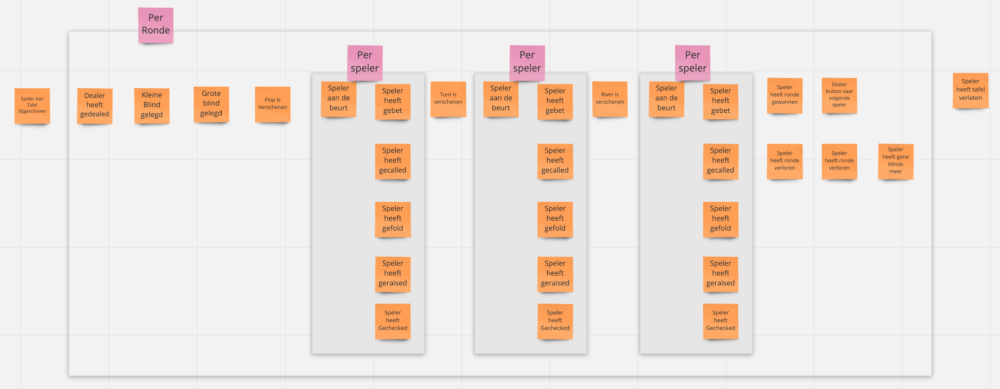
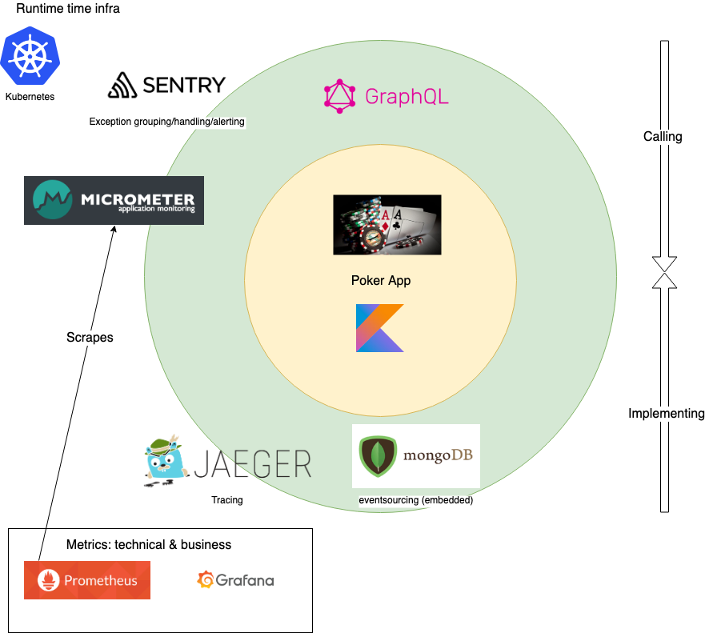
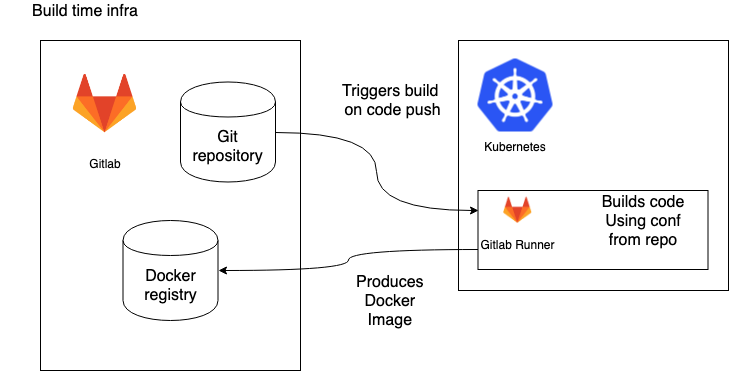

## Status
[](https://gitlab.rotate-it.be/tripled/poker/commits/master)
[](https://gitlab.rotate-it.be/tripled/poker/commits/master)
[](https://github.com/KotlinBy/awesome-kotlin)
[](https://tripled-io.slack.com/messages/opentripled)


## Functional

We assume most people are familiar with texas holdem, poker, here's an eventstorming overview of what it looks like:



There is also a video on how to play:
[](https://www.youtube.com/watch?v=GAoR9ji8D6A)


## Getting started

### Build & run the backend
* ./gradlew assemble check jacocoTestReport detekt
* ./gradlew build
* ./gradlew bootRun

##$ Build & run the front-end

* cd poker-ui-app
* npm run build of yarn build
* npm start of yarn start


### Use It 
* localhost:3000 for the hosted frontend
* localhost:8080/graphiql for direct graphiql api on the backend
* localhost:8080/api/businessMetric for businessMetric of the backend


## Technical Setup
### Technologies

* Gradle
* Kotlin
* Spring-boot
    * actuator
    * web
* Embedded mongo
* Graphql & graphiql
    * [See GraphQl with Spring boot](https://github.com/graphql-java-kickstart/graphql-spring-boot)
* [Prometheus](https://docs.spring.io/spring-metrics/docs/current/public/prometheus)
    * business & technical metrics
* [Grafana spring boot dashboard](https://grafana.com/dashboards/4701)


### Infrastructure
#### Runtime infra


#### Build infra


## Added keycloak gatekeeper
```
helm upgrade --install --version 1.6.0 \
    --set discoveryURL=https://keycloak.otd.rotate-it.be/auth/realms/poker \
    --set upstreamURL=http://poker-svc.poker-265.svc.cluster.local:8080 \
    --set ClientID=localtest \
    --set ClientSecret=ef5d811f-af5e-4a54-904c-11095fe716cf \
    --set ingress.enabled=true \
    --set scopes[0]=openid \
    --set ingress.hosts[0]=pokers.otd.rotate-it.be \
    --set forwarding.enable=true \
    --set forwarding.username=pkr \
    --set forwarding.password=pkrpass \
    secure-poker gabibbo97/keycloak-gatekeeper
```